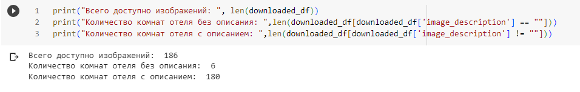

# tinkoff-sirius-ml-2023-cv-aliens

## **Общие рекомендации:**

Для запуска блокнота по обогащению тегов требуется запустить блокнот [tinkoff-sirius-ml-2023-cv-aliens](https://github.com/denis-samatov/tinkoff-sirius-ml-2023-cv-aliens/tree/main).&#x20;

## **Кейс по Image Captioning и Diffusion Filters**

## Формирование образа и предпочтений инопланетян

### Описание **инопланетянина.**

Представители инопланетной цивилизации обладают зеленой кожей и черными глазами, но по остальным физическим характеристикам они схожи с человеком. У них имеется две руки и две ноги, и их общая анатомия очень напоминает человеческую. Однако, среди интересных особенностей инопланетян стоит отметить их способность к более высокой степени фотосинтеза, благодаря чему они могут питаться не только обычной пищей, но и солнечным светом, что делает их более независимыми от ресурсов.

Кроме того, инопланетяне имеют развитую способность к телепатии, что позволяет им общаться ментально, без использования слов. Их культурная жизнь также включает в себя уникальные формы искусства, основанные на использовании света и звука, что создает невероятные визуальные и аудиальные впечатления. Их стремление к путешествиям и отдыху часто проявляется в исследовании разных миров и космических реальностей, что делает их настоящими путешественниками во вселенной.

<figure><figcaption>
Фотография типичного инопланетянина
</figcaption></figure>

### **Предпочтения инопланетян при выборе отеля:**

1. **Пространство и комфорт**: Инопланетяне предпочитают просторные номера, где они могут свободно передвигаться и чувствовать себя комфортно. Узкие и маленькие помещения не соответствуют их предпочтениям.
2. **Вид на окружающую среду**: Инопланетяне ценят природную красоту и архитектурный ландшафт. Они предпочитают номера с панорамными видами на городские пейзажи или природные окрестности, что позволяет им наслаждаться окружающей средой.
3. **Гармоничный дизайн интерьера**: Инопланетяне предпочитают интерьеры с гармоничным и спокойным дизайном. Им нравятся рельефные обои и нейтральные цвета, которые создают атмосферу уюта и гармонии.
4. **Современные удобства**: В отеле они ожидают наличие современных удобств, таких как беспроводной интернет, кондиционеры, телевизоры и другие современные технологии, которые обеспечивают комфортное пребывание.
5. **Развлечения и отдых**: Инопланетяне также ценят разнообразные развлекательные возможности в отеле, такие как бассейн, фитнес-зал, рестораны и бары, что позволяет им наслаждаться отдыхом и развлечениями во время пребывания.

## Изучение датасета

### **Тема и ее проблематика**

#### **Что такое image captioning?**

**Image captioning** - это задача компьютерного зрения и обработки естественного языка, которая заключается в автоматическом генерировании текстовых описаний для изображений. Суть задачи заключается в создании модели, способной анализировать содержание изображения и генерировать текстовое описание, которое максимально точно и емко описывает то, что видно на изображении.

#### **Почему над этим работают?**

**Image captioning** активно исследуется и разрабатывается по нескольким причинам:

1. Улучшение доступности изображений для людей с ограниченными возможностями. Генерируя текстовые описания, можно сделать изображения более доступными для слепых и слабовидящих людей.
2. Повышение качества поиска и индексации изображений. Текстовые описания позволяют поисковым системам и алгоритмам легче находить и классифицировать изображения.
3. Улучшение пользовательского опыта. Image captioning может быть использовано в приложениях для смартфонов и веб-сервисах, чтобы предоставлять более информативные и интересные описания для пользователей.

#### Как формулируется задача?

Для каждого изображения требуется сгенерировать текстовое описание, которое наиболее точно отражает содержание изображения. Это представляет собой задачу обучения с учителем, где модель обучается на парах "изображение - описание", используя размеченный датасет.

### Аннотация датасета Hotels-50K:

Датасет Hotels-50K представляет собой обширную коллекцию из более чем 1 миллиона изображений, собранных из 50 000 различных отелей по всему миру. Эти изображения были собраны с веб-сайтов, связанных с туризмом, а также с помощью мобильного приложения TraffickCam, которое позволяет обычным путешественникам отправлять изображения своих номеров в отелях с целью помочь в борьбе против торговли людьми. Важно отметить, что изображения, полученные из приложения TraffickCam, имеют больше визуальных сходств с изображениями из расследований по торговле людьми, чем изображения с туристических веб-сайтов.

#### **Что представлено на изображениях?**

Датасет Hotels-50K содержит более 1 миллиона изображений, представляющих интерьеры и экстерьеры отелей со всего мира. Эти изображения включают в себя разнообразные аспекты гостиничного бизнеса, такие как номера, лобби, бассейны, рестораны и другие объекты и сцены, связанные с гостиничными учреждениями.

#### **Сколько объектов в датасете? Сколько уникальных классов? Сбалансирован ли датасет?**

Датасет включает более 1 миллиона изображений, но фактически в обучающей выборке удалось загрузить только 866 изображений. Датасет состоит из 50,000 различных отелей, что означает, что в среднем на каждый отель приходится около 20 изображений. Количество уникальных классов равно количеству отелей в датасете, что составляет 50,000 классов. Датасет не является сбалансированным, так как количество изображений от каждого отеля может значительно различаться (рис. 1). Это может повлиять на процесс обучения модели и требует учета при анализе результатов.

<figure><figcaption>
Рисунок 1
</figcaption></figure>

#### **Какие параметры у изображений? Размер фотографий?**&#x20;

Все изображения имеют тип uint8. Все изображения в RGB имеют три цветовых канала. Размер изображений варируется от (170, 350, 3) до (3024, 4032, 3).&#x20;

## Обогащение датасета описаниями

* В процессе предобработки изображений были выполнены следующие шаги: каждое изображение было изменено до размера 256х256 пикселей, затем оно было разбито на более мелкие патчи. Для анализа каждого патча использовалась модель CLIP, которая позволила присвоить каждому патчу соответствующий тег.
* Важно отметить, что в данном случае предобработка и обогащение данных касались каждой фотографии в датасете. Практически к каждой из них было добавлено описание.
* В результате обогащения данных были достигнуты хорошие результаты. Алгоритм обогащения тегами, описанный в блокноте ipynb, привел к тому, что описание удалось присвоить всем фотографиям, кроме трех из 186. Это считается успешным результатом. Затруднения с присвоением описаний трем фотографиям были связаны с ограниченным количеством доступных тегов. При добавлении более обширных тематических тегов, связанных с отельной индустрией, вероятно, удастся присвоить описания всем фотографиям.

<figure><figcaption></figcaption></figure>

* Кластеризовать датасет не удается. Это достаточно ожидаемо, на это есть несколько причин:\
  1\. Изначально датасет несбалансирован. \
  2\. Количество отелей  туркомпании, количество фотографий на каждый отель несбалансированы.\
  3\. Выборка, которая взята для обогащения тегами неполная.

<figure><figcaption></figcaption></figure>

## Изменение изображения при помощи диффузионной модели

* Выбранные фотографии:

<figure><figcaption>
Фото №1
</figcaption></figure>

<figure><figcaption>
Фото №2
</figcaption></figure>

<figure><figcaption>
Фото №3
</figcaption></figure>

<figure><figcaption>
Фото №4
</figcaption></figure>

<figure><figcaption>
Фото №5
</figcaption></figure>

* Фотографии после преобразования

<figure><figcaption>
Фото №1 изменение тумбочек и добавление кресла перед кроватью
</figcaption></figure>

<figure><figcaption>
Фото №1 греческий стиль
</figcaption></figure>

<figure><figcaption>
Фото №2 изменение вида из окна
</figcaption></figure>

<figure><figcaption>
Фото №2 изменение обоев и вида из окна
</figcaption></figure>

<figure><figcaption>
Фото №3 изменение фона из окна и стены шкафа
</figcaption></figure>

<figure><figcaption>
Фото №3 Чайный столик вмето телевизора
</figcaption></figure>

<figure><figcaption>
Фото №4 Добавлено кресло и изменены обои
</figcaption></figure>

<figure><figcaption>
Фото №4 Изменен вид из окна и ковер
</figcaption></figure>

<figure><figcaption>
Фото №5 Портал вместо окна, столовая переделана в офисную комнату
</figcaption></figure>

<figure><figcaption>
Фото №5 Столовая переделана в офисную комнату с инопланетными растениями
</figcaption></figure>

*   Изменение только части изображения:

    inpaint - позволяет нанести на участок изображения слой-маску и сгенерировать что-то только на нем, не затрагивая остальной рисунок. Можно инвертировать - рисовать везде, кроме замаскированного слоя (Inpaint not masked) . Можно загружать изображение с готовой маской, сделанной где-то еще (Upload mask) , можно нарисовать в браузере самому. Края маски можно размывать через Mask blur для более плавного перехода.\
    \
    img2img alternative test - меняем только часть изображения по текстовому описанию.\
    \
    Ссылка: [https://dtf.ru/howto/1379961-izuchaem-vozmozhnosti-stable-diffusion-chast-2](https://dtf.ru/howto/1379961-izuchaem-vozmozhnosti-stable-diffusion-chast-2)\

* В общем и целом, удалось достигнуть ожидаемых результатов в процессе работы, однако следует признать, что некоторые из сгенерированных изображений имеют заметные дефекты. Несмотря на усилия в настройке гиперпараметров и параметров модели, не всегда удается полностью устранить эти дефекты.

Важно подчеркнуть, что в мире искусственного интеллекта и генеративных моделей полное избавление от дефектов может быть сложной задачей, и иногда компромисс между качеством и разнообразием генерируемых изображений необходим. Несмотря на недостатки, продолжение исследований и развитие модели может привести к дальнейшему улучшению результатов и устранению дефектов.
